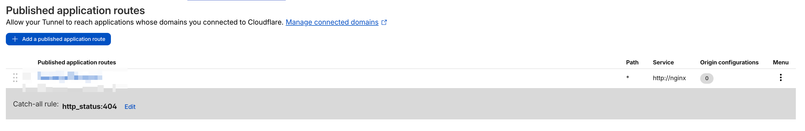
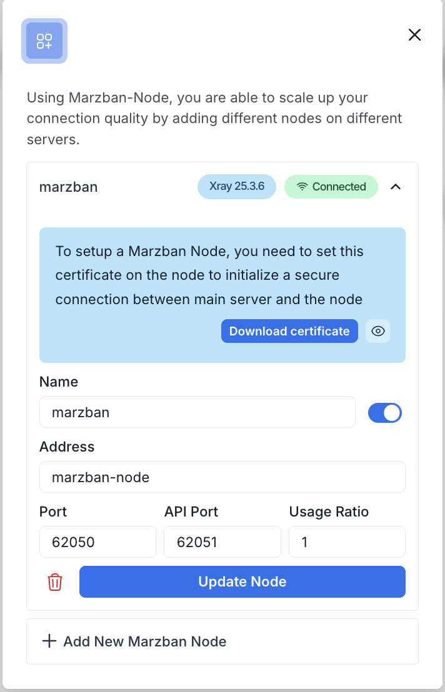
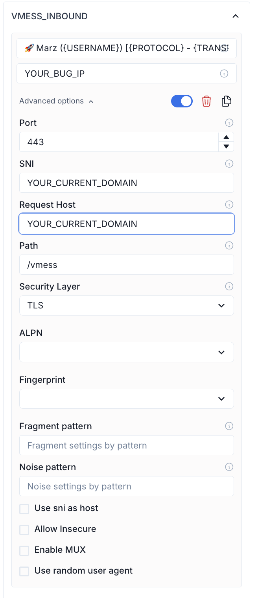
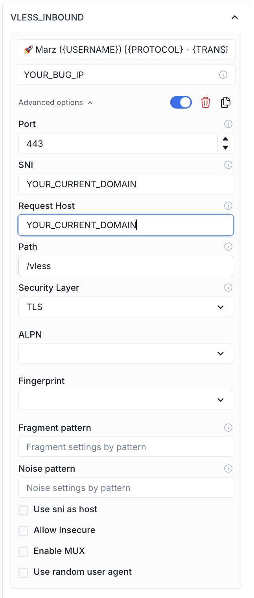
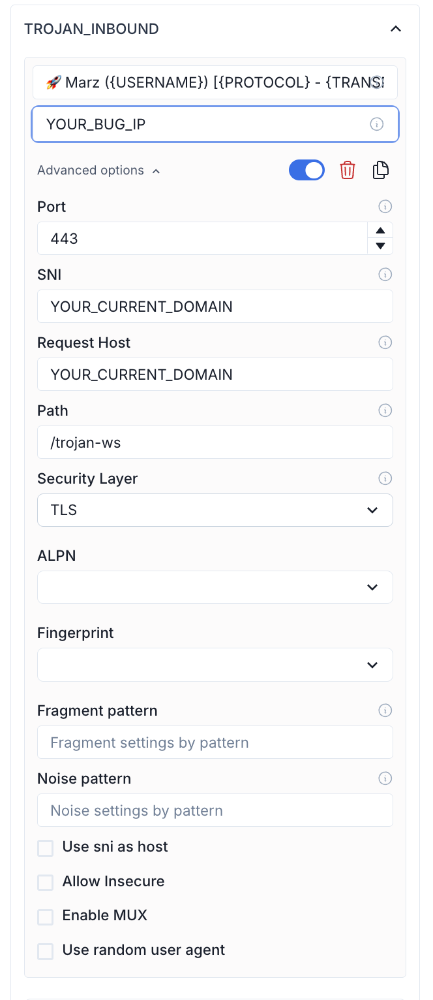

## 🧩 Marzban + Nginx + Node

**Marzban + Nginx Reverse Prox + Nodey** in Docker 🐳

This repository provides a complete setup using **Docker Compose** to run [Marzban](https://github.com/Gozargah/Marzban) (an Xray management panel) with **Nginx reverse proxy** and **SSL certificate** support.

---

### ✨ Features

* 🔐 Nginx reverse proxy for managing VMess, VLESS, Trojan, and Shadowsocks traffic
* 📊 Marzban panel accessible via a public port (`8899`)
* 🌐 Xray protocol access only via reverse proxy (no raw port exposure)
* 📦 Persistent configuration to ensure data remains safe even after `docker compose down`
* 🔧 Compatible with servers without public IPs, optionally integrates with **Cloudflare Tunnel**

---

### 📁 Folder Structure

```
.
├── docker-compose.yml         # Main Docker Compose file
├── nginx.conf                 # Main Nginx configuration
├── xray.conf                  # Reverse proxy virtual host for all protocols
├── marzban/  
│   └── xray_config.json       # Xray configuration (VMess, VLESS, etc.)
```

---

## 🚀 Quick Start

Clone this repository and start the services:

```bash
git clone https://github.com/sh4dowByte/marzban-nginx-node.git
cd marzban-nginx-node
```

## ☁️ Using Cloudflare Tunnel

To run Marzban + Nginx + Cloudflare Tunnel:

```bash
docker compose up -d
```

Ensure your `.env` file contains your Cloudflare Tunnel token:

```env
TUNNEL_TOKEN=your_cloudflare_token
```

---

## ☁️ Secure & Easy Access to Marzban via Cloudflare Tunnel

Want to access your **Marzban panel** securely without exposing ports? Use **Cloudflare Tunnel** with a subpath like:

### 🌐 Example:



Access Marzban at:

```
https://YOUR_DOMAIN/dashboard
```


---

### ⚙️ Marzban Node Settings Example:


After setting up the node, make sure to properly configure the SSL certificate.

### 📂 File Location

Navigate to the following file:

```
ssl/ssl_client_cert.pem
```

### ✏️ Steps

1. Open the **Marzban Panel Dashboard**
2. Go to **Node / Connection Settings**
3. Find the **SSL Client Certificate**
4. Copy the entire certificate content
5. Open the file:

```
ssl/ssl_client_cert.pem
```

6. Replace all contents of the file with the copied certificate
7. Save the file

### ⚠️ Important Notes

* Make sure the format remains valid (usually starts with):

  ```
  -----BEGIN CERTIFICATE-----
  ```

  and ends with:

  ```
  -----END CERTIFICATE-----
  ```
* Do not add extra spaces or characters
* Use UTF-8 encoding without BOM

---

### ⚙️ Marzban Panel Settings Example:

| VMESS                                          | VLESS                                          | TROJAN                                         |
| ---------------------------------------------- | ---------------------------------------------- | ---------------------------------------------- |
|  |  |  |

---

### ✨ Benefits:

* 🔒 **Secure**: No need to expose port 80/443 publicly
* ☁️ **Reliable**: Leverages Cloudflare’s infrastructure — perfect for servers without public IPs
* 🎯 **Custom Path**: Run the panel under a subpath like `/dashboard`
* 💡 **Cost-Effective**: No need for static IP or premium VPS

### ⚠️ Cons:

* 🕓  **Slight Latency Overhead** : Requests go through Cloudflare’s edge, adding a small delay compared to direct IP access
* 🔧  **Tunnel Dependency** : If the Cloudflare Tunnel fails, access to your panel is lost (unless you expose it directly too)
* 🔒  **Cloudflare Account Required** : You must have a Cloudflare account and configure a domain or use a token
* 🧪  **Debugging Complexity** : Troubleshooting reverse proxy or path issues can be more complex compared to direct hosting

---

Thanks to the open-source community for continuously strengthening the Xray and Marzban ecosystem! 💪🚀

---
